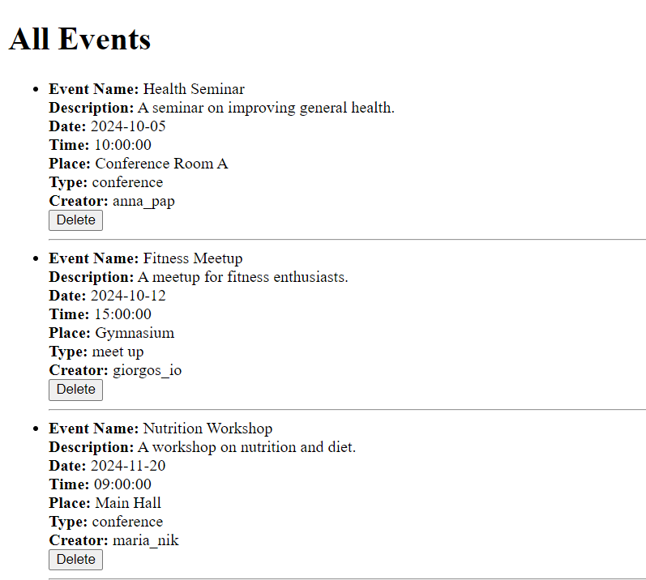

## Περιεχόμενα

* Εισαγωγή
* Επιπλέων Παραδοχές και Παρεκκλίσεις
* Τεχνολογίες που Χρησιμοποιήθηκαν
* Περιγραφή των Αρχείων
* Τρόπος Εκτέλεσης Συστήματος
* Τρόπος Χρήσης του Συστήματος
* Αναφορές

## Εισαγωγή

Το παρόν αρχείο περιέχει τον κώδικα ενός API Server, το οποίο επιτρέπει τη διαχείριση εκδηλώσεων με την χρήση μιας Mongo Database. Ο server δέχεται αιτήματα από τους χρήστες και τον διαχειριστή για την προβολή, συμμετοχή, δημιουργία και επεξεργασία εκδηλώσεων.

## Επιπλέων Παραδοχές και Παρεκκλίσεις

* Για την αλληλεπίδραση του χρήστη με τον server υλοποιήθηκε μια απλή διεπαφή χρήστη (UI) χρησιμοποιώντας τεχνολογία **HTML**.

* Στην εφαρμογή χρησιμοποιήθηκε βάση δεδομένων **MongoDB** για την αποθήκευση των δεδομένων. Οι συλλογές που δημιουργήθηκαν είναι:

### Συλλογή `users`
Τα πεδία που περιέχει είναι:
- `first_name`
- `last_name`
- `username`
- `email`
- `password`

### Συλλογή `events`
Τα πεδία που περιέχει είναι:
- `name`
- `description`
- `date`
- `time`
- `place`
- `type`
- `creator`
- `participants`
  - `username`
  - `status`

## Τεχνολογίες που Χρησιμοποιήθηκαν

* Flask: Framework για την υλοποίηση του API Server.
* MongoDB: Χρησιμοποιείται για την αποθήκευση των εκδηλώσεων και των χρηστών.
* Docker: Χρησιμοποιήθηκε για την containerization της εφαρμογής.
* Python: Η γλώσσα προγραμματισμού στην οποία υλοποιήθηκε ο server.
* HTML: Για τη δημιουργία των σελίδων διεπαφής χρήστη.

## Περιγραφή των Αρχείων

* `data`: Backup δεδομένων βάσης
* `flask-server`:
    * `app`:
        * `templates`: Σελίδες διεπαφής χρήστη.
        * `__init__.py`: Αρχικοποίηση της εφαρμογής.
        * `routes.py`: Αρχείο που ορίζονται οι REST διαδρομές και μέθοδοι.
        * `routes2.py`: Αρχείο με μεθόδους για επικοινωνία με τη βάση.
    * `assets`:
        * `users.json`: Δεδομένα για γέμισμα του collection User.
        * `events.json`: Δεδομένα για γέμισμα του collection Event.
    * `Dockerfile`: Αρχείο για την κατασκευή εικόνας Docker για το API.
    * `main.py`: Το entry point αρχείο του project.
    * `requirements.txt`: Κατάλογος με τις απαραίτητες βιβλιοθήκες Python για την εκτέλεση του API.
* `images`: Screenshots εφαρμογής.
* `docker-compose.yml`: Αρχείο για την εκκίνηση των containers API και MongoDB.
* `README.md`: Αρχείο τεκμηρίωσης.

## Τρόπος Εκτέλεσης Συστήματος

1. Κατεβάστε τον φάκελο του έργου.
2. Ανοίξτε ενα command window και μεταβείτε στο σωστό directory με την εντολή `cd`.
##### Παράδειγμα:
```
cd C:\Users\your_name\Event Project
```
3. Σιγουρευτείτε οτι το Docker Engine τρέχει και δημιουργήστε τα containers:

```
docker-compose up -d
```
4. Περιμένετε μέχρι να εκκινήσουν τα containers.
5. Το API θα είναι διαθέσιμο στη διεύθυνση `http://localhost:5000/`.

## Τρόπος Χρήσης του Συστήματος

### Είσοδος στο Σύστημα
Στη σελίδα `/` ο χρήστης μπορεί να συνδεθεί ή να πάει στην σελίδα δημιουργίας λογαριασμού.


### Εγγραφή στο Σύστημα
Στη σελίδα `/register` ο χρήστης μπορεί να δημιουργήσει λογαριασμό.


### Μενού Χρήστη
Στη σελίδα `/user` βρίσκεται το μενού που βλέπει ο χρήστης μετά την σύνδεση του. Μπορεί να επιλέξει απο διάφορες επιλογές ή να αποσυνδεθεί.


### Προβολή Όλων των Εκδηλώσεων
Στη σελίδα `/all_events` ο χρήστης μπορεί να δει όλες τις εκδηλώσεις και να επιλέξει να δει περισσότερες λεπτομέρειες.


### Προβολή μίας Εκδήλωσης
Όταν επιλέξει να δει τις λεπτομέρειες μιας εκδήλωσης, ο χρήστης ανακατευθύνεται στη σελίδα `/view_event/<event_name>`. Εκεί μπορεί να δει όλα της τα χαρακτηριστικά, τους συμμετέχοντες ή να επιλέξει να συμμετέχει και ο ίδιος.


### Αναζήτηση Εκδήλωσης
Στη σελίδα `/search_events` ο χρήστης μπορεί να αναζητήσει μια εκδήλωση με βάση το όνομα, την περιγραφή, το είδος και το μέρος.


### Κατασκευή Εκδήλωσης
Στη σελίδα `/create_event` ο χρήστης μπορεί να δημιουργήσει μια εκδήλωση.


### Προβολή Κατασκευασμένων Εκδηλώσεων
Στη σελίδα `/created_events` ο χρήστης μπορεί να δει τις εκδηλώσεις που δημιούργησε και να επιλέξει αν θέλει να δει περισσότερες λεπτομερειες, να επεξεργαστεί ή να διαγράψει μια εκδήλωση.


### Ενημέρωση Πληροφορίας Κατασκευασμένης Εκδήλωσης
Όταν επιλέξει να επεξεργαστεί μια εκδήλωση, ο χρήστης ανακατευθύνεται στη σελίδα `/update_event/<event_name>`. Εκεί μπορεί να επιλέξει ποιό χαρακτηριστικό θέλει να αλλάξει και να εισάγει τη νέα πληροφορία.


### Προβολή των Εκδηλώσεων που ο Χρήστης Συμμετέχει
Στη σελίδα `/participated_events` ο χρήστης μπορεί να δει όλες τις εκδηλώσεις που συμμετέχει.


### Επιλογή Ρόλου Διαχειριστή
Αν ο χρήστης που συνδεθεί είναι ο διαχειριστής εμφανίζεται η σελίδα `/admin_role` όπου μπορεί να επιλέξει τι ρόλο θέλει να εχει σε αυτή τη σύνδεση.


### Μενού Διαχειριστή
Στη σελίδα `/admin` ο διαχειριστής μπορεί να επιλέξει να δει όλες τις εκδηλώσεις, όλους τους χρήστες ή να αποσυνδεθεί.


### Δαχείρηση Εκδηλώσεων
Στη σελίδα `/admin/view_all_events` ο διαχειριστής μπορεί να δει όλες τις εκδηλώσεις και να διαγράψει κάποια.



### Διαχείρηση Χρηστών
Στη σελίδα `/admin/view_all_users` ο διαχειριστής μπορεί να δει όλους τους χρήστες και να διαγράψει κάποιον.


## Αναφορές

* Διαφάνειες Εργαστηρίων
* GitHub Εργαστηρίου